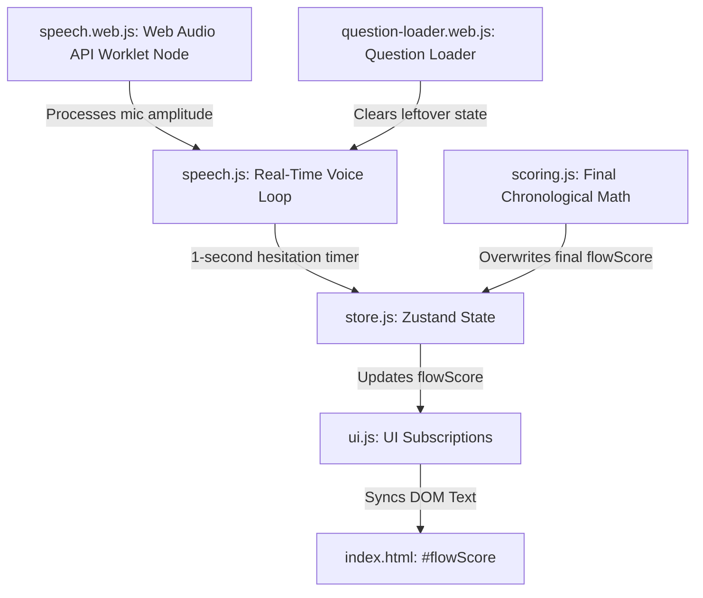

# Technical Brief: Real-Time Hesitation Scoring System

This document outlines the architecture, data flow, key components, and identified engineering blockers for the **Real-Time Hesitation Scoring System** in the UFF English application. It serves as a comprehensive blueprint for any developer to audit, debug, or implement this feature flawlessly.

---

## 1. Feature Specifications

1. **Scoring Metric**: Hesitation (Silence) deductions apply to the **Flow (Fluency)** sub-score, not the Listening score.
2. **Scoring Cadence**: During the real-time speech recording stage, if the user remains silent, their score must deduct at a rate of **10 points per second** (or smoothly at **1 point per 100ms**).
3. **Voice Detection (Onset)**: The real-time countdown begins immediately upon microphone activation. The moment the user starts speaking (voice onset detected), the silence countdown must stop immediately.
4. **State Isolation**: The `flowScore` must strictly start at **100** for every new question. Score reductions do not carry over between lesson questions.
5. **Score Synchronization**: Real-time score deductions must be reactively bound to the DOM element (`#flowScore`) so the user sees the points ticking down in real time, accompanied by point-loss floating animations.
6. **ASR Score Congruence**: At the end of the recording, the final offline audio trimming/evaluation must calculate silence duration and produce an equivalent Flow deduction congruent with the real-time updates.

---

## 2. Key Components & Files



### A. Zustand State Store (`js/modules/store.js`)
*   **State Variable**: `flowScore` (initial: `100`).
*   **Action**: `deductFlowScore(amount)`:
    ```javascript
    deductFlowScore: (amount) => set((state) => ({
        flowScore: Math.max(0, state.flowScore - (Number(amount) || 0))
    }))
    ```
*   **Action**: `resetForNextQuestion()`:
    Must explicitly reset all category sub-scores to `100` before loading the next step:
    ```javascript
    resetForNextQuestion: () => set({
        listeningScore: 100,
        speakingScore: 100,
        flowScore: 100, // <-- Crucial
        fluencyScore: 100,
        // ... other sub-scores
    })
    ```

### B. Speech Engine & Timers (`js/modules/speech.js`)
*   **Timer State**: `listeningState.hesitationTimer` (tracks the running `setInterval` ID).
*   **Recording Trigger**: `toggleSpeechRecognition(params)`:
    *   Starts the recording stream.
    *   Spawns `hesitationTimer = setInterval(...)` running every `1000ms`.
    *   On each interval tick, calls `appStore.getState().deductFlowScore(10)` and invokes the `onHesitation` UI animation callback.

### C. Web Audio API Voice Activation Detector (`js/modules/speech.web.js`)
*   **Audio Tap**: `startLocalAudioTap(stream, onSpeechDetected)`:
    *   Attaches an `AudioWorkletNode` (`audio-processor.js`) to capture mic data at `16000Hz`.
    *   Reads float chunks (128 samples per message).
    *   Determines whether the amplitude exceeds a speech threshold to trigger `onSpeechDetected()`.
    *   When `onSpeechDetected()` triggers inside `speech.js`, the hesitation timer is immediately cancelled via `clearInterval(listeningState.hesitationTimer)`.

### D. UI Synchronization & Animations (`js/components/ui.js` & `question-loader.web.js`)
*   **State Subscription**: Inside `ui.js` `initUISubscriptions()`:
    ```javascript
    store.subscribe((state) => {
        if (state.flowScore !== prevFlow) {
            syncFlowScore(state.flowScore);
            prevFlow = state.flowScore;
        }
    });
    ```
*   **DOM Updates**: `syncFlowScore(flowScore)` updates the `#flowScore` element in `index.html`.
*   **Floating Text**: `uiHooks.onHesitation` triggers a floating animation (e.g. `-10` drifting upwards over the `#flowScore` badge) using the `pointLoss` animation class.

### E. Final Evaluation Calculations (`js/modules/scoring.js`)
*   **Chronological Trimming**: At the end of speech, the raw buffer is processed via `trimSilenceWithPadding` to find the exact millisecond index of the first spoken frame.
*   **Congruent Math**: The hesitation duration is calculated, and the final Flow score matches it:
    ```javascript
    hesitationScore = Math.max(0, 100 - Math.floor(hesitationDurationMs / 100)); // 10 pts per 1000ms
    ```

---

## 3. The Three Critical Engineering Blockers

Any developer working on this must be aware of these three subtle bugs that cause scoring loops or frozen states:

### 1. Microphone Startup Click/Pop (false onset detection)
*   **The Bug**: Standard webcams and headsets emit a brief electrical/audio click (spike in amplitude) the millisecond the stream opens.
*   **The Symptom**: The real-time speech detector sees this click, thinks the user has already spoken, and immediately clears the hesitation timer before the first second even ticks. The real-time Flow score remains stuck at `100`.
*   **The Remedy**: Implement a *consecutive chunk buffer* in `startLocalAudioTap`. Instead of letting a single chunk (> `0.01` amp) trigger voice detection, require at least **4 consecutive chunks** (approx. 32ms) to exceed a threshold of `0.03` to qualify as human speech onset.

### 2. Async Click Race Conditions (overlapping scoring intervals)
*   **The Bug**: `toggleSpeechRecognition` is asynchronous because hardware camera/microphone allocation takes time. If a user double-clicks the microphone button or the speech precheck restarts the recorder, multiple async executions run concurrently.
*   **The Symptom**: Multiple active `setInterval` loops are created in parallel, causing the score to deduct multiple times faster than intended (e.g., ticking down by 10 points every 100ms).
*   **The Remedy**: Implement a strict state transition lock:
    ```javascript
    if (listeningState.transitioning) return;
    listeningState.transitioning = true;
    try {
        // start/stop microphone stream...
    } finally {
        listeningState.transitioning = false;
    }
    ```

### 3. Leftover Timers (carry-over scoring)
*   **The Bug**: If a lesson question changes (e.g., user clicks "Continue") while a microphone timer was in a pending or dirty state, the interval is never destroyed.
*   **The Symptom**: The leaked timer continues to run in the background, deducting flow scores on subsequent questions.
*   **The Remedy**: In the question loading module (`question-loader.web.js`), the very first action of `loadQuestion()` must explicitly clear any lingering intervals:
    ```javascript
    if (listeningState.hesitationTimer) {
        clearInterval(listeningState.hesitationTimer);
        listeningState.hesitationTimer = null;
    }
    ```

---

## 4. Recommended Step-by-Step Developer Action Plan

If the system is experiencing infinite loops, frozen countdowns, or silent failures, follow this audit list:

1.  **Verify Web Audio Worklet Binding**: Check browser developer tools to ensure `AudioWorkletNode` is loading successfully and outputting `Max Amplitude` logs without throwing class-registration errors.
2.  **Audit the Transition Lock**: Put console logs at the entry and exit of `toggleSpeechRecognition` to ensure the `transitioning` lock is releasing properly and not leaving the button permanently locked.
3.  **Trace Interval IDs**: Print `listeningState.hesitationTimer` to the console during startup and shutdown. Ensure the ID changes sequentially and returns to `null` the exact moment speech is detected or recording stops.
4.  **Confirm Element ID Presence**: Ensure `<span id="flowScore">` is fully rendered in the DOM when `initUISubscriptions` runs, and that `prevFlow` is initialized correctly from the store to trigger the initial reactive sync.
